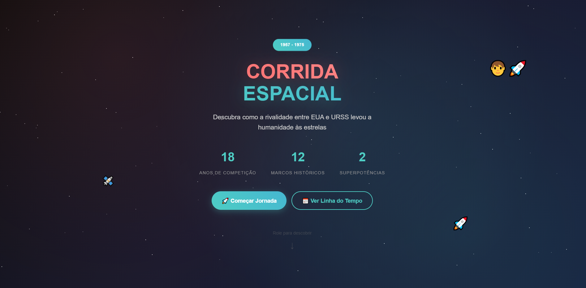

# 🌌 Corrida Espacial — Linha do Tempo Interativa

Projeto desenvolvido para a disciplina de História. O objetivo é apresentar os principais eventos da **Corrida Espacial** em formato de **linha do tempo interativa**, utilizando **HTML**, **CSS** e **JavaScript**.

## 🛰️ Sobre o Projeto

A Corrida Espacial foi um dos capítulos mais emblemáticos da Guerra Fria, marcando a disputa tecnológica entre Estados Unidos e União Soviética. Este site tem como finalidade apresentar os principais marcos históricos desse período de forma visual e interativa, facilitando o aprendizado.

## 🔧 Tecnologias Utilizadas

- 
- 
- 

## 📌 Funcionalidades

- ✅ Linha do tempo dos principais eventos da Corrida Espacial  
- ✅ Design responsivo para dispositivos móveis  
- ✅ Scroll suave para navegação entre seções  
- ✅ Destaques visuais para datas importantes  
- ✅ Capa atrativa com título e introdução

## 📷 Preview

## 👨‍🏫 Créditos

Desenvolvido por **Matheus Habeck** e **Gustavo Minatto**  
Professor: **Argemiro**  
Escola: **Escola SESI Senai**

## 📖 Licença

Este projeto é apenas para fins educacionais e não possui fins comerciais.
